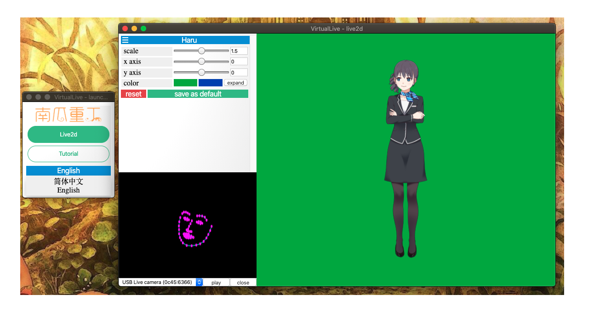

## Overview
Virtual-Live is a desktop program that aims to enable anyone to use a webcam to control live2d characters. This program is developed for Mac, but could be compatible with Windows and Linux after modification. 

## Demo
GIF

Screenshot

## Features
- Use webcam/mouse to control model
- Switch between different models
- Customize chroma key color and model size/position
- Multi-language support (English and Chinese)
- Change App settings at system tray

## Installation
See [GETTING_STARTED.md](GETTING_STARTED.md)

## Future Plans
This project is no longer in activate development. Live2dViewerEx now supports user controlled live2d model on Mac, and Animaze or PrprLive can replace Facerig with lower CPU load on Windows. For me, it's not worthwhile to reinvent the wheel. For anyone who happen to see this repo, happy hacking every day.
